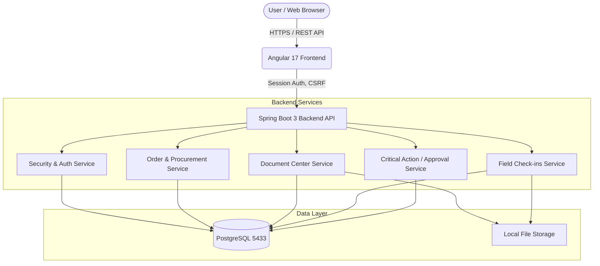

# System Design Document: PharmaProcure Compliance Procurement Portal

## 1. System Overview

**PharmaProcure** is an offline-capable compliance procurement portal designed for regulated pharmaceutical and procurement operations. It facilitates secure authentication, end-to-end procurement lifecycle management, controlled document handling, field evidence check-ins, and strict dual-approval workflows for compliance-critical actions.

The system is delivered as a containerized, full-stack application built on a modern Angular 17 frontend and a robust Spring Boot 3 / Java 17 REST backend, backed by PostgreSQL. 

## 2. Architecture Overview

## 3. Technology Stack

### Frontend
- **Framework:** Angular 17 (Standalone Components)
- **UI/UX:** Angular Material, premium custom theme, reactive forms, and offline-capable SVG icons.
- **State Management:** Reactive asynchronous observables (`AuthService.user$`) reliant on HttpOnly cookies. No sensitive token data is placed in `localStorage`.
- **Modularity:** Highly structured layers combining `core` (guards, interceptors, services), `shared`, and feature-specific workspaces (`features`, `layout`).

### Backend
- **Framework:** Spring Boot 3.3.x / Java 17
- **Architecture Style:** Layered standard enterprise architecture (`controller`, `service`, `repository`, `dto`, `entity`, `security`, `validation`, `audit`, `config`, `util`).
- **Build Tool:** Maven

### Data & Infrastructure
- **Relational Database:** PostgreSQL (exposed natively on port 5433 to prevent local conflicts).
- **Schema Management:** Flyway Migrations for strictly controlled and versioned schema changes.
- **Storage:** Backend file volumes for immutable document and check-in evidence storage.
- **Deployment:** Zero-config automated startup utilizing Docker Compose.

## 4. Key Architectural Patterns

- **API Interception & Security Shielding:** Operations securely enforce HttpOnly cookies for session management. Interceptors safely enforce CSRF tokens exclusively on state-modifying requests (safeguarding POST/PUT/DELETE operations).
- **Comprehensive API Error Handling:** Implementations use an application-wide interceptor pattern that bubbles up standard constraint violations gracefully to the client.
- **Data Obfuscation / Masking:** Backend log policies systematically scrub or desensitize potentially sensitive data spills.

## 5. Security & Authorization Models

- **Authentication:** Native session-centric authentication paired with standard BCrypt password hashing. Brute-force protections include a 5-failure threshold executing a 15-minute global account lockout and secondary CAPTCHA enforcement. 
- **Roles-Based Access Control (RBAC):** Top-level navigation and page component visibility strictly enforced by a robust `roleGuard` processing dynamic route data configurations.
- **Object-Level Authorization:** Driven by a `PermissionAuthorizationService`, ensuring horizontal data isolation logic scales properly (e.g., scoping entity resolutions by `SELF`, `ORGANIZATION`, `TEAM`, or `GLOBAL`).
- **Administrative Controls:** The shipped admin workspace supports user activation/suspension, state-transition activation toggles, document-type maintenance, and managed reason-code administration. The permission matrix is exposed as a read-only overview.
- **Audit Trails:** Immutable logging enforces comprehensive tracing. Actions spanning read (downloads/previews), updates, and approval routing register permanent system-level attribution.

## 6. Core Business Workflows

### 6.1 Procurement Lifecycle (Order Management)
- Orders transition through heavily controlled statuses: `Draft` → `Ready for Review` → `Approved` (Quality) → `Payment Recorded` (Finance) → `Fulfillment` (Pick/Pack/Ship) → `Receipt` → `Completed`.
- Receipts mandate discrepancy checks if arriving units un-align with shipped counts, requiring exception handling.
- Returns and after-sales requests use admin-managed reason-code catalogs so operational exceptions stay traceable and standardized.
- After-sales requests (e.g., damaged goods, temperature excursions) maintain dedicated lifecycle linkages separated from primary receipt logs to preserve immutability.

### 6.2 Controlled Document Center
- Documents enter as Drafts and graduate into formal routing pipelines requiring explicit approval workflows before attaining an `Archived`/controlled state.
- Official sequential numbering occurs only upon reaching controlled authorization (preventing sequence gaps).
- **Document Destruction:** Prohibits hard deletion. A soft-delete destruction mechanism is initiated subject to Dual Approval, strictly retaining metadata and audit lineage.
- Preview/content responses for supported preview MIME types are watermarked server-side using username, timestamp, and document number. Direct downloads preserve the original stored artifact while still generating audit events. Server-side SHA-256 signatures are persistently tracked for content integrity verifications.

### 6.3 Field Evidence Check-Ins
- Purpose built for site logging (e.g., browser-captured device timestamp, optional coordinates, inspector notes, and multimedia evidence arrays).
- Employs a fully versioned update mechanism. User modifications initiate new revisions with tracked changed fields and revision-scoped attachments so the detail view can render a revision trail for both metadata and evidence.

### 6.4 Dual Approval Mechanics (Critical Actions)
- System actions tagged as critical risk (Order Cancellations, Document Destruction, Override Approvals) mandate cross-role authorization by one `QUALITY_REVIEWER` approver and one `FINANCE` or `SYSTEM_ADMINISTRATOR` approver.
- Enforces user-disjoint rules: request originators cannot self-approve requests.
- Requests enforce automated lifecycle invalidation (Time-to-Live) configured primarily at 24 hours.

## 7. Next-Phase Considerations
- **Access-Control Administration:** User activation/suspension is configurable today, but role-grant editing is still represented through the permission overview rather than a full grant-management workflow.
- **Deployment Strategy:** Further environment configuration scaling beyond baseline `docker-compose` towards container orchestrators (e.g., Kubernetes).
